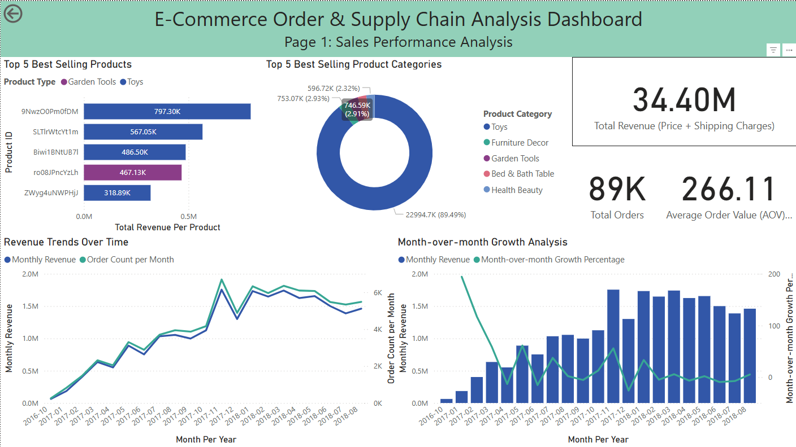
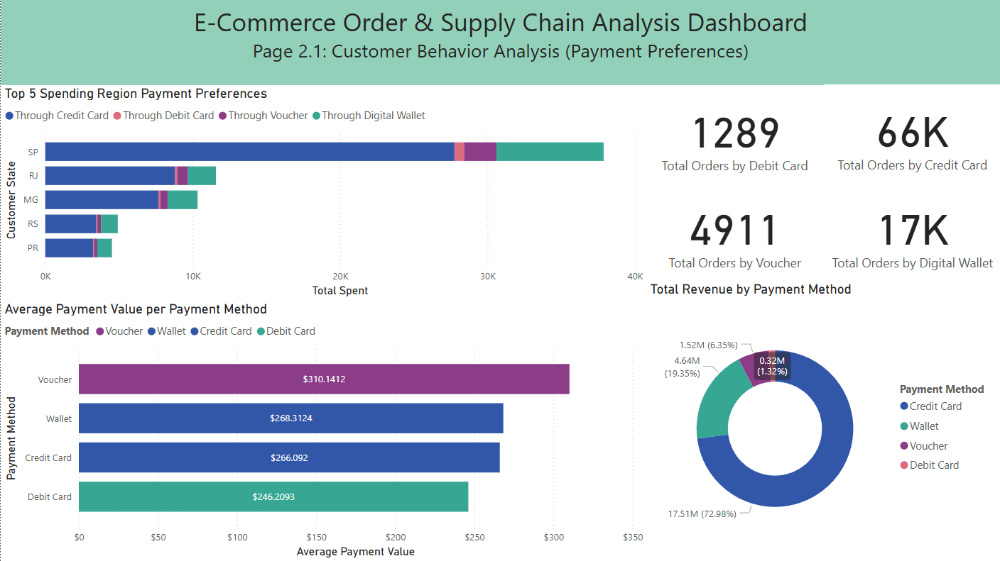
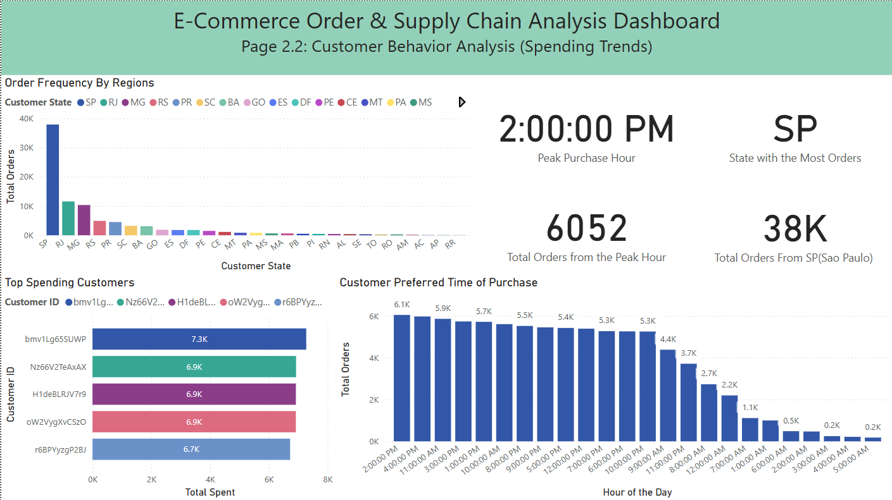
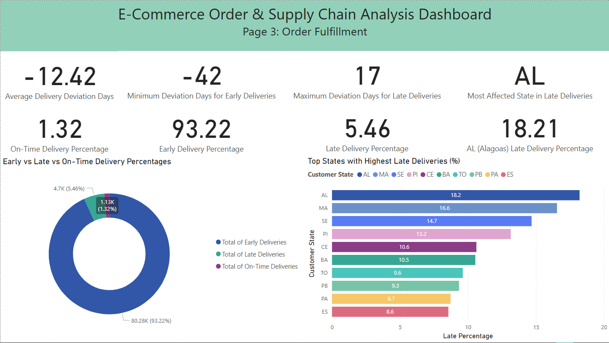

# E-Commerce Order & Supply Power BI Project
In this Portfolio Project, I visualized my findings on my E-Commerce Order & Supply Exploratory Analysis Project.

## Content
The Dashboard contains 4 Pages and 2 Tooltips

### Sales Performance Analysis Dashboard
- This page covered `Top 5 Selling Products`, `Top 5 Best Selling Product Categories`, `Revenue Trends Over Time` & `Month-over-month Growth Percentage`.
- In Month-over-month Growth Percentage, there is a noticeable decline between 2016-10 to 2017-01. This is because of the dataset being flawed as it is missing values between 2016-11 to 2016-12.

### Customer Behavior Analysis (Payment Preferences)
- Customer Behavior is a 2 part section as it covers customer "Payment Preferences" & "Spending Trends". In Payment Preferences, we covered the `Preferred Payment Method in the Top 5 Spending Regions`, `Average Payment Value per Payment Method`, and `Total Revenue per Payment Method`.

### Customer Behavior Analysis (Spending Trends)
- In Spending Trends, we covered `Order Frequency per Region`, `Top Spending Customers`, and `Customer Preferred Time of Purchase`.

### Order Fulfillment Analysis
- The last and final part of our E-Commerce Order & Supply Chain Project, Order Fulfillment. We provided data on the `Delivery Deviation Days`, `Early vs Late vs On-Time Delivery Percentages`, and `Top States with Highest Late Delivery Percentages`.

