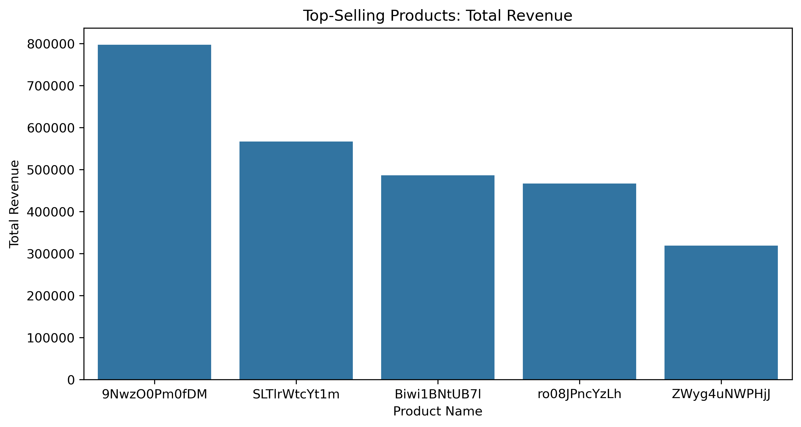
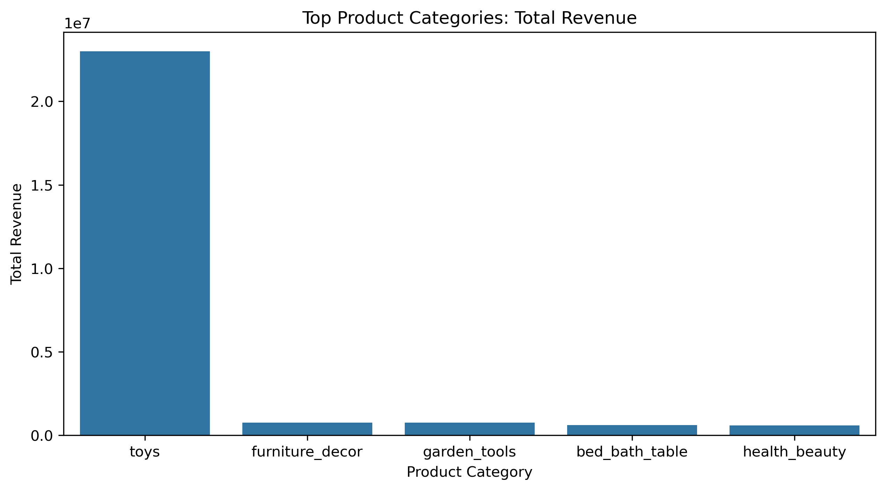
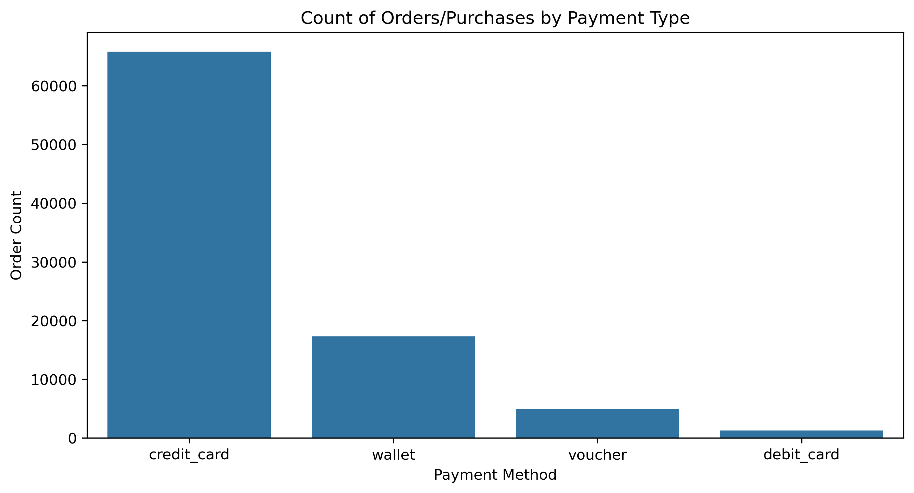
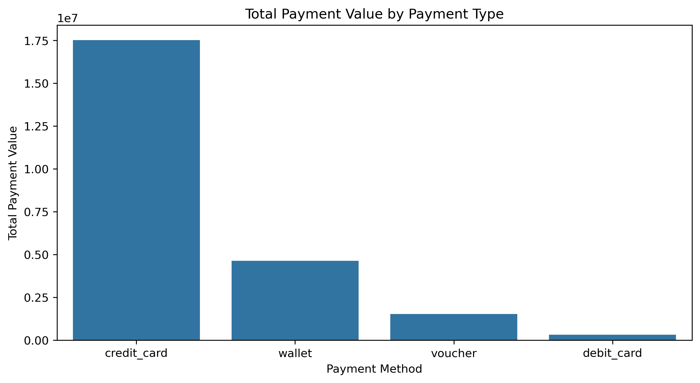
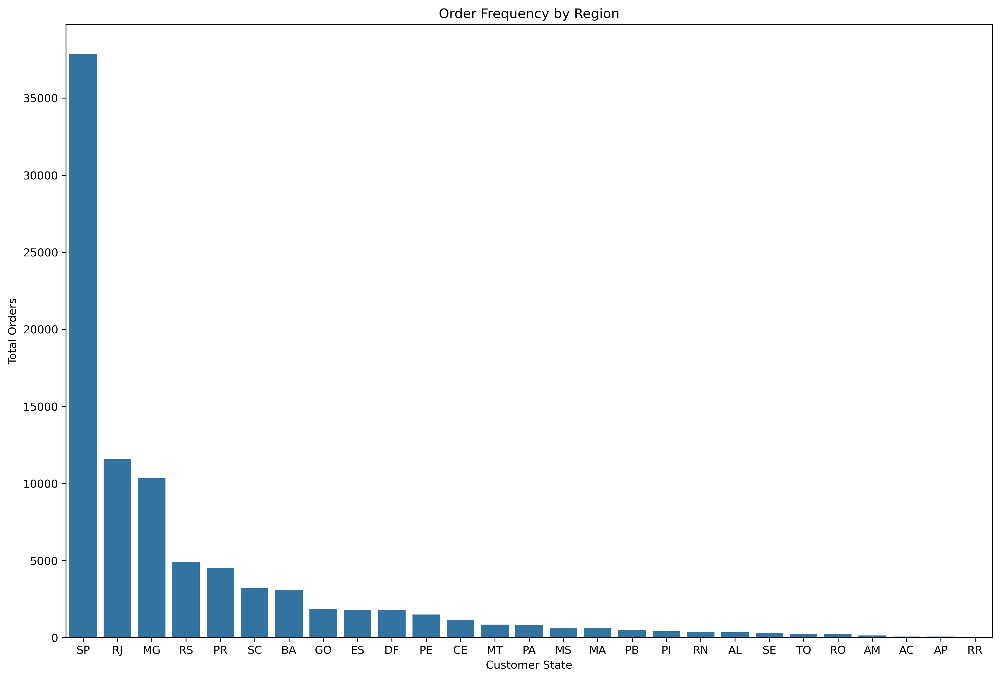
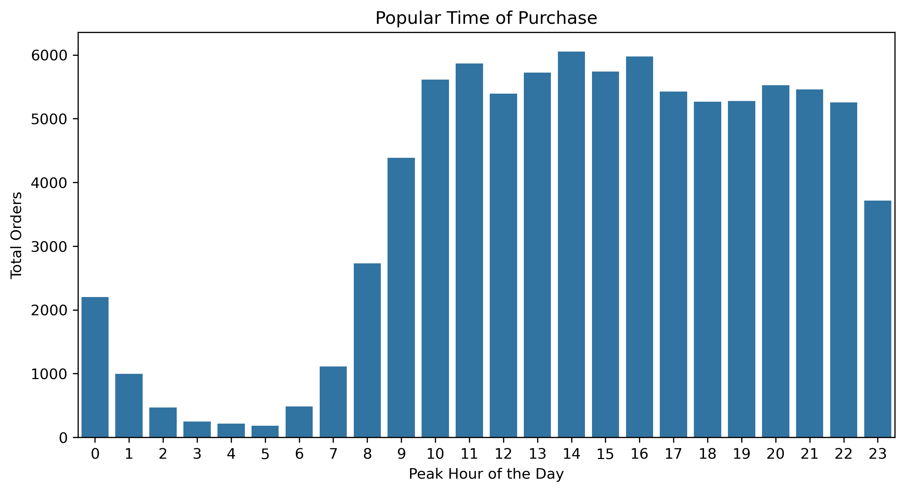
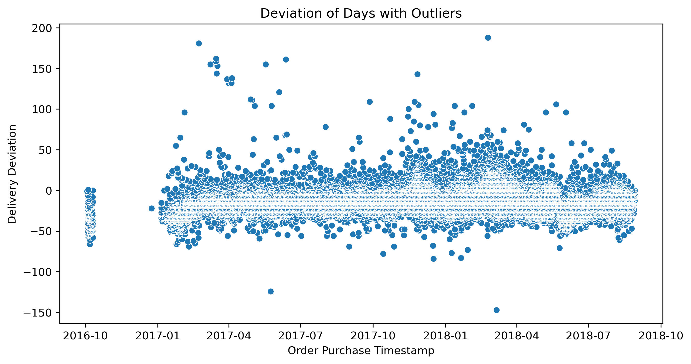
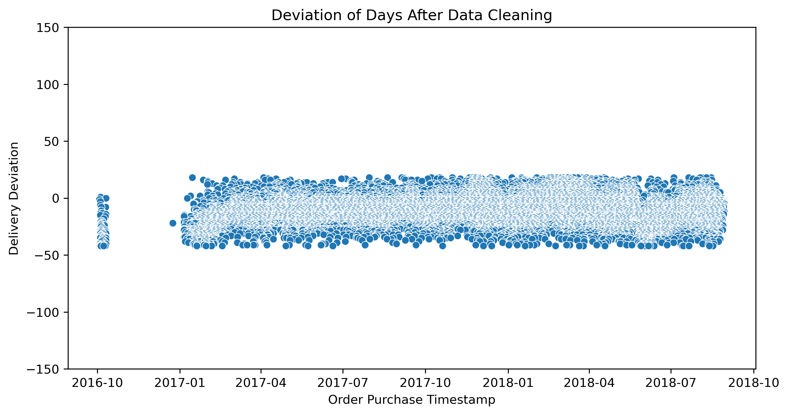

# E-Commerce Order and Supply Chain Exploratory Data Analysis
This project analyzes E-Commerce orders and payment data to uncover and provide insights on **sales performance**, **customer behavior** and **order fulfillments**.

## Project Overview

### Dataset Used
The dataset used was from a website called **Kaggle** called `Ecommerce Order & Supply Chain` focusing on a logistics company based in Brazil. This consists of information about customer orders, payment method, product details, and delivery timestamps. A wide variety of products are found in this dataset ranging from home decors to toys. The dataset is flawed, however, with missing row values on certain tables and dates ranging only from `Q4 2016` - `Q3 2018` but despite the flaws, we still managed to work around it with `Optimization Queries` and `Data Cleaning` without interference on our project's main objectives.

### Dataset Link: 
- **https://www.kaggle.com/datasets/bytadit/ecommerce-order-dataset**

### Objective
Our main objectives and goals for this Project are:
- **Sales Performance Analysis:** Examining the total sales, top-selling products, analyzing revenue trends over time, month-over-month revenue growths, the average order values per month, and sales seasonality analysis.
- **Customer Behavior Analysis:** Understanding how customers behave in terms of sales whether if its dependent on the region they belong, their payment preferences, and the amount they spend on a single transaction.
- **Order Fulfillment Efficiency:** Investigating early vs. late deliveries and identifying regions with the most consistent delays.

## How to use this Repository
This Repository contains SQL queries analyzing the E-Commerce Orders and Supply Chain Data. The queries are organized into folders based on their focus area. **Click on each link to see the queries!**

### Repository Structure & Queries
#### Sales Performance Analysis Queries:
- **[Total Revenue & Number of Orders](https://github.com/cartiace0004/Portfolio/blob/main/E-Commerce-Order-Supply-Chain-Analysis/Sales-Performance-Analysis-Queries/total_revenue.sql)**
- **[Top-Selling Products](https://github.com/cartiace0004/Portfolio/blob/main/E-Commerce-Order-Supply-Chain-Analysis/Sales-Performance-Analysis-Queries/top_selling_products.sql)**
- **[Top Product Categories](https://github.com/cartiace0004/Portfolio/blob/main/E-Commerce-Order-Supply-Chain-Analysis/Sales-Performance-Analysis-Queries/top_product_categories.sql)**
- **[Revenue Trends Analysis](https://github.com/cartiace0004/Portfolio/blob/main/E-Commerce-Order-Supply-Chain-Analysis/Sales-Performance-Analysis-Queries/revenue_trends_analysis.sql)**
- **[Month-over-month Growth Analysis](https://github.com/cartiace0004/Portfolio/blob/main/E-Commerce-Order-Supply-Chain-Analysis/Sales-Performance-Analysis-Queries/month-over-month-growth.sql)**
- **[Average Order Value](https://github.com/cartiace0004/Portfolio/blob/main/E-Commerce-Order-Supply-Chain-Analysis/Sales-Performance-Analysis-Queries/average-order-value.sql)**
- **[Sales Seasonality Analysis](https://github.com/cartiace0004/Portfolio/blob/main/E-Commerce-Order-Supply-Chain-Analysis/Sales-Performance-Analysis-Queries/sales-seasonality-analysis.sql)**

#### Customer Behavior Analysis Queries:
- **[Top-Spending Customers](https://github.com/cartiace0004/Portfolio/blob/main/E-Commerce-Order-Supply-Chain-Analysis/Customer-Behavior-Queries/top_spender_customer.sql)**
- **[Regional Spending Trends](https://github.com/cartiace0004/Portfolio/blob/main/E-Commerce-Order-Supply-Chain-Analysis/Customer-Behavior-Queries/regional_spending_trends.sql)**
- **[Payment Preferences](https://github.com/cartiace0004/Portfolio/blob/main/E-Commerce-Order-Supply-Chain-Analysis/Customer-Behavior-Queries/payment_preferences.sql)**
- **[Customer Behavioral Patterns](https://github.com/cartiace0004/Portfolio/blob/main/E-Commerce-Order-Supply-Chain-Analysis/Customer-Behavior-Queries/customer_behavioral_patterns.sql)**

#### Order Fulfillment Analysis Queries:
- **[Delivery Accuracy Assessment](https://github.com/cartiace0004/Portfolio/blob/main/E-Commerce-Order-Supply-Chain-Analysis/Order-Fulfillment-Efficiencies-Queries/delivery_accuracy_assessment.sql)**
- **[Measure Early vs. Late Deliveries](https://github.com/cartiace0004/Portfolio/blob/main/E-Commerce-Order-Supply-Chain-Analysis/Order-Fulfillment-Efficiencies-Queries/measure_early_vs_late_deliveries.sql)**
- **[Identifying the Worst-Affected Regions in Late Deliveries](https://github.com/cartiace0004/Portfolio/blob/main/E-Commerce-Order-Supply-Chain-Analysis/Order-Fulfillment-Efficiencies-Queries/identify_the_worst_affected_regions_for_late_deliveries.sql)**

## Key Insights

### 1. Sales Performance
- **Top-Selling Products:** the top 5 best selling products are mostly from the `Toys` category with a small niche of profitable market for `Garden Tools` being the only product that is a non-toy.

*Figure 1.1: Top Products*

- **Top-Selling Product Categories:** `Toys` dominate in total revenue, followed by `Furniture Decorations` then `Garden Tools`. This could mean that the logistics company has a good reputation for handling and delivering large items safely from hubs to their respective buyers.

*Figure 1.2: Top Categories*

- **Analyzing Revenue Trends Overtime:** Revenue trends are greatly affected by seasons, holiday-promotion sales and market saturation.
- **Month-over-month Growth:** Ups and downs in terms of revenue growth, having a strong early start in the 1st quarter of 2017 followed by a Revenue spike mid to late 2017, stability in Q1 2018, then steady decline in Q2-Q3 of 2018 implying market saturation.
- **Average Order Value (AOV):** Relatively stable, peaks align with high-sale months such as November's infamous `Black Friday Sale`.
- **Sales Seasonality Analysis:** Steady rise in `AOV` suggests customers are spending slightly more per transaction, but revenue growth is still mainly *volume-driven*. The highest-grossing quarter was Q1 2018, telling us seasonal trends and holiday-promotion sales are a big factor.

### 2. Customer Behavior
- **Top-Spending Customers:** The dataset consists of unique `customer_id`'s per transaction, meaning it is hard to track repeating customers. But in each transaction, customers are capable of *bulk-buying*. As the top-spender in the dataset bought 31 units of a product that is priced R$231.8 (Price + Shipping Fee) summing up into R$7274.88.
- **Regional Spending Trends:** Top-spending regions were `Sao Paulo`, `Rio de Janeiro`, `Belo Horizonte`, `Brasilia` all indicate a dense customer base having significant purchasing power.
- **Payment Preferences:** `Credit Card` payment methods are the top choice, accounting forthe highest order volume indicating that customers prefer the convenience and security associated with credit cards followed by `Digital Wallets`, highlighting a growing trend in digital payment methods, suggesting customers are likely looking for faster and a more seamless way to pay online.

*Figure 1.3: Count of Orders*

*Figure 1.4: Total Payment Value*

- **Behavioral Patterns of Customers:** This section uncovered customer's behavior patterns and the order volume per region. Firstly, we uncovered the order frequency of each regions. This returns which regions has the highest volume of purchases and these were the states of `Sao Paulo`, `Rio de Janeiro`, and `Minas Gerais`. This correlates to the fact that these are the top 3 most populated states in Brazil, meaning these regions have the densest customer bases.

*Figure 1.5: Order Frequency Per Region*

We also uncovered every customer's preferred hour of purchase throughout the day. The busiest are in the afternoons, specifically at `2:00 PM`/`14th hour of the day`.

*Figure 1.6: Customer Peak Hours*

### 3. Order Fullfilment Efficiency
- **Delivery Accuracy Assessment:** We encountered problems with this section of our analysis as `Outliers` were skewing our results. We did a little Data Cleaning in order to exempt these Outliers by first finding the optimal range where the deviation of estimated delivery and actual delivery days are on par to real-time records. In order to achieve this, we filtered out these extreme cases of Outliers beyond 3 standard deviations. We used `3` so that we could *encapsulate all rows that have reasonable values*, leaving the extreme cases outside the normal distribution, thus returning only the values that have reasonable records. Also in this section, we discovered that the logistics company handle their `estimated delivery dates` too conservatively as most of the results are early deliveries.

*Figure 1.7: Avg Early vs Late Deliveries with Outliers*

This is how the dataset looked like after Data Cleaning: Outliers Removed:

*Figure 1.8: Avg Early vs Late Deliveries after Data Cleaning*

- **Measure Early vs. Late Deliveries:** The early delivery percentage of every orders fulfilled by the company have a massive 93.22%, while their on time percentage is 1.32% and late percentage is 5.46%.
- **Identify the worst-affected Regions for Late deliveries:** `Alagoas (AL)` tops the list with an 18.21% late delivery rate, followed by `Maranhao (MA)` with 16.55%. Suggesting certain regional logistics challenges in the Northeast region of Brazil.

## Business Recommendations:
- **Leverage Seasonal Campaigns:** Offering discounts and targeted promotions to maximize revenue in future holiday/season events.
- **Improve Revenue Growth Beyond Order Volume:** Upselling & Cross-Selling: Bundle products, introduce premium options. Also encourage repeat purchases with discounts for high-spenders and bulk-buyers.
- **Improve Delivery Estimates:** Investigate late delivereis, especially in specific regions to address supply chain inefficiencies and enhance customer experience. Also, refining the estimated delivery times by reducing the gap between estimated and actual delivery can improve customer trust.
- **Optimize Payment Methods:** Promote *wallet* and *credit card* payment methods by offering incentives, as these methods have higher average transaction values. Also encouragement of *debit card* usage such as offering cashback on high-ticket purchases made through debit cards or running targeted promotions as this payment method is underused most of the time. 
- **Regional Distribution Centers:** Establish or enhance fulfillment hubs closer to locations with high late-delivery percentages as this could strengthen customer trust leading to repeated purchases.
- **Carrier & Infrastructure Audit:** Consider *multi-carrier strategies* for remote areas. 

## Technologies Used
- **SQL**: Data Manipulation, aggregation, and analysis.
- **Python**: Data analysis and visualization using Pandas, Matplotlib and Seaborn.
- **MySQL Workbench**: Database management and query execution.
