# MTN Nigeria Customer Churn Exploratory Data Analysis

## What is MTN Nigeria?
- MTN Nigeria Communications PLC is the leading telecommunications provider in Nigeria and a subsidiary of the **MTN Group**, a multinational telecom company headquartered in South Africa. Established in 2000, MTN Nigeria has grown to become the country's largest mobile network operator per [Emis](https://www.emis.com/php/company-profile/NG/Mtn_Nigeria_Communications_Plc_en_8352912.html).

## What is Customer Churn?
- Customer churn is a business phenomenon where customers stop doing business with a company or stop using a product/service over a given period of time. Also known as **customer attrition**.

### Why does it matter in Business?
- Churn is a key performance indicator for many businesses, especially in industries like:

  - Subscription services
  - Telecommunications
  - SaaS
  - Banking & Insurance
  - E-Commerce

### What are common causes of Churn?
- Causes vary as these range from `Poor customer service`, `High prices`, `Better offers from competitors`, `Lack of product engagement or perceived value` and `Bad user experience`.

## Relevance of the Analysis
- Given MTN Nigeria's extensive subscriber base and diverse service offerings, analyzing customer churn can provide insights into:

  - **Customer Retention**: Understanding why customers discontinue services can help in developing strategies to improve retention.
  - **Service Improvement**: Identifying patterns in churn can highlight areas where service enhancements are needed.
  - **Market Strategy**: Analyzingg churn across different demographics and regions can inform targeted marketing and service delivery.

## The Dataset
- The dataset was taken from [Kaggle](https://www.kaggle.com/datasets/oluwademiladeadeniyi/mtn-nigeria-customer-churn?resource=download). The dataset simulates the behaviour, preferences and churn patterns of MTN Nigeria customers in Q1 2025. It provides rich insight into device usage, data plan preferences, age, groups, tenure, churn drivers, and revenue patterns. The dataset contains 974 rows and possess the following columns:

  - Customer ID: A unique identifier assigned to each customer. It may appear more than once if the customer owns multiple devices.
  - Full Name: The full name of the customer. Names reflect a balance across Nigerian ethnicities and regions.
  - Date of Purchase: Month and year the device or plan was purchased. All entries are from 2025.
  - Age: Age of the customer (between 16 and 80). Rules apply to age and purchasing behaviour.
  - State: Nigerian state where the customer resides, including the FCT.
  - MTN Device: Device purchased by the customer. Includes: Mobile SIM Card, Broadband MiFi, 4G Router, 5G Broadband Router.
  - Gender: Gender of the customer (Male or Female).
  - Satisfaction Rate: A score from 0 to 5 reflecting the customer’s satisfaction.
  - Customer Review: Categorical review of the customer experience: Poor, Fair, Good, Very Good, Excellent.
  - Customer Tenure in months: How long the customer has been subscribed (in months).
  - Subscription Plan: The name of the MTN data plan purchased (e.g., 60GB Monthly Broadband Plan, 7GB Monthly Plan, etc.).
  - Unit Price: Cost of the data plan in Nigerian Naira (₦).
  - Data Usage: Estimated data usage in gigabytes (GB). Not necessarily equal to the plan size—it reflects usage behaviour.
  - Number of Times Purchased: How many times the plan was purchased within the month (simulates customer consumption rate).
  - Total Revenue: Total amount spent by the customer (calculated as Unit Price × Number of Times Purchased).
  - Customer Churn Status: Indicates whether the customer has churned (Yes) or is still active (No).
  - Reasons for Churn: If churned, this field shows the reason (e.g., Poor Network, Relocation, High Call Tariffs, etc.). Empty for active customers.

The currency used in the dataset is **Nigerian Naira (₦)**.

## Data Cleaning
1. The dataset consisted of columns with their names not snake_cased. For it to be easier to code, we converted the column names to a much more efficient and easier to write on query snake_cased format:

```sql
ALTER TABLE mtn_customer_churn
CHANGE COLUMN `Date of Purchase` date_of_purchase VARCHAR(20),
CHANGE COLUMN `Customer ID` customer_id VARCHAR(20),
CHANGE COLUMN `Age` age INT,
CHANGE COLUMN `State` state VARCHAR(20),
CHANGE COLUMN `MTN Device` mtn_device VARCHAR(20),
CHANGE COLUMN `Gender` gender VARCHAR(20),
CHANGE COLUMN `Satisfaction Rate` satisfaction_rate INT,
CHANGE COLUMN `Customer Review` customer_review VARCHAR(20),
CHANGE COLUMN `Customer Tenure in months` customer_tenure_mnths INT,
CHANGE COLUMN `Subscription Plan` subscription VARCHAR(500),
CHANGE COLUMN `Unit Price` unit_price INT,
CHANGE COLUMN `Number of Times Purchased` num_purchase INT,
CHANGE COLUMN `Total Revenue` total_revenue INT,
CHANGE COLUMN `Data Usage` data_usage DECIMAL(5, 2),
CHANGE COLUMN `Customer Churn Status` churn_status VARCHAR(20),
CHANGE COLUMN `Reasons for Churn` reason VARCHAR(500);

ALTER TABLE mtn_customer_churn
CHANGE COLUMN `Full Name` full_name VARCHAR(50);
```

2. Converted the `Date of Purchase` column from having the first 3 strings cite the first 3 letters of the Months in Q1 into numerical month format:

```sql
UPDATE mtn_customer_churn
SET date_of_purchase = CONCAT(
    CASE LEFT(date_of_purchase, 3)
      WHEN 'Jan' THEN '01'
      WHEN 'Feb' THEN '02'
      WHEN 'Mar' THEN '03'
      ELSE '00'
	END,
    '-20',
    RIGHT(date_of_purchase, 2)
);
```

3. It was given in the Dataset description that there will be duplicate entries of `CustomerID` as this pose as customers having multiple devices listed in the Dataset, still, the possibility of **EXACT DUPLICATES** is still there; So we did that with:

```sql
SELECT
customer_id, full_name, COUNT(*) as duplicate_count
FROM mtn_customer_churn
GROUP BY customer_id, full_name, date_of_purchase, age, state, mtn_device, gender, satisfaction_rate,
customer_review, customer_tenure_mnths, subscription, unit_price, num_purchase, total_revenue, data_usage,
churn_status, reason
HAVING duplicate_count > 1;
```
Result:
| customer_id | full_name | duplicate_count |
|-------------|-----------|-----------------|

*No duplicates found in this query result.*

4. Since there weren't any exact duplicates in the dataset, let's check the amount of devices a customer can posses in the dataset:

```sql
SELECT
customer_id, full_name, COUNT(DISTINCT mtn_device) as device_count
FROM mtn_customer_churn
GROUP BY 1, 2
ORDER BY device_count DESC
LIMIT 10; #the top 10 customers have a maximum device count of 3
```
Result:
| customer_id   | full_name       |   device_count |
|:--------------|:----------------|---------------:|
| CUST0015      | Abubakar Garner |              3 |
| CUST0500      | Oghene Hamilton |              3 |
| CUST0003      | Saidu Evans     |              3 |
| CUST0016      | Kunle Ford      |              3 |
| CUST0020      | Amaka Reed      |              3 |
| CUST0006      | Tamuno Lewis    |              3 |
| CUST0025      | Ifeanyi Brown   |              3 |
| CUST0030      | Alabo Davis     |              3 |
| CUST0027      | Maryam Reyes    |              3 |
| CUST0010      | Halima Ochoa    |              3 |

**The maximum amount of devices a customer possess are 3 devices.**

5. Let's see if there are null values in the reason column:

```sql
SELECT
	COUNT(*) as total_rows, 
	COUNT(reason) as reason_filled,
	SUM(CASE WHEN reason IS NULL OR reason = '' THEN 1 ELSE 0 END) as reason_missing
FROM mtn_customer_churn; #690 customers have reason for churn as empty
```

Result:
|   total_rows |   reason_filled |   reason_missing |
|-------------:|----------------:|-----------------:|
|          974 |             974 |              690 |

**690 customers have reason for churn as empty, but these only apply to customers who HAVEN'T churned from MTN**

6. Let's double-check if **ALL** missing reasons are only for customers who retained:

```sql
SELECT 	DISTINCT churn_status,
		COUNT(*) as count_missing_reason
FROM mtn_customer_churn
WHERE reason IS NULL OR reason = ''
GROUP BY 1; #all of the 690 missing churn reason are from customers who have not churned
```

Result:
| churn_status   |   count_missing_reason |
|:---------------|-----------------------:|
| No             |                    690 |

**It seems all 690 missing reasons are from customers who haven't churned.**

7. Create a `churn_flag`  column which converts the `churn_status` "Yes" and "No" into numeric 1 or 0 for deeper analysis:

```sql
ALTER TABLE mtn_customer_churn
ADD COLUMN churn_flag TINYINT;

UPDATE mtn_customer_churn
SET churn_flag = CASE
	WHEN churn_status = 'Yes' THEN 1
	ELSE 0
END;

ALTER TABLE mtn_customer_churn
MODIFY COLUMN churn_flag TINYINT AFTER churn_status; #move the churn_flag column next to the churn_status column
```

## Exploratory Data Analysis
### 1. What Percentage of MTN Nigeria have churned out of the total customer base?

```sql
SELECT
    COUNT(DISTINCT customer_id) AS total_customers,
    COUNT(DISTINCT CASE WHEN churn_status = 'Yes' THEN customer_id END) AS churned_customers,
    ROUND(
        COUNT(DISTINCT CASE WHEN churn_status = 'Yes' THEN customer_id END) * 100.0 / COUNT(DISTINCT customer_id),
        2
    ) AS churn_rate_percent
FROM mtn_customer_churn;
```
|   total_customers |   churned_customers |   churn_rate_percent |
|------------------:|--------------------:|---------------------:|
|               496 |                 146 |                29.44 |


**Insights**:
- About 29.44% of MTN Nigeria's customers in this dataset have churned. Thats almost 3 out of every 10 customers, a significant number worth digging into.
- About 3 out of every 10 Nigerian MTN customers have churned, based on unique customer IDs. 
- This reflects a churn rate of approximately 29.44%, accounting for distinct customers rather than multiple device entries per customer.

### 2. What are the top reasons for churn?

```sql
SELECT	reason, COUNT(DISTINCT customer_id) as count
FROM	mtn_customer_churn
WHERE	churn_status = 'Yes' AND reason IS NOT NULL AND reason <> ''
GROUP BY	1
ORDER BY 	count DESC;
```
| reason                         |   count |
|:-------------------------------|--------:|
| Better Offers from Competitors |      29 |
| High Call Tarriffs             |      26 |
| Costly Data Plans              |      20 |
| Poor Network                   |      20 |
| Fast Data Consumption          |      18 |
| Poor Customer Service          |      18 |
| Relocation                     |      15 |

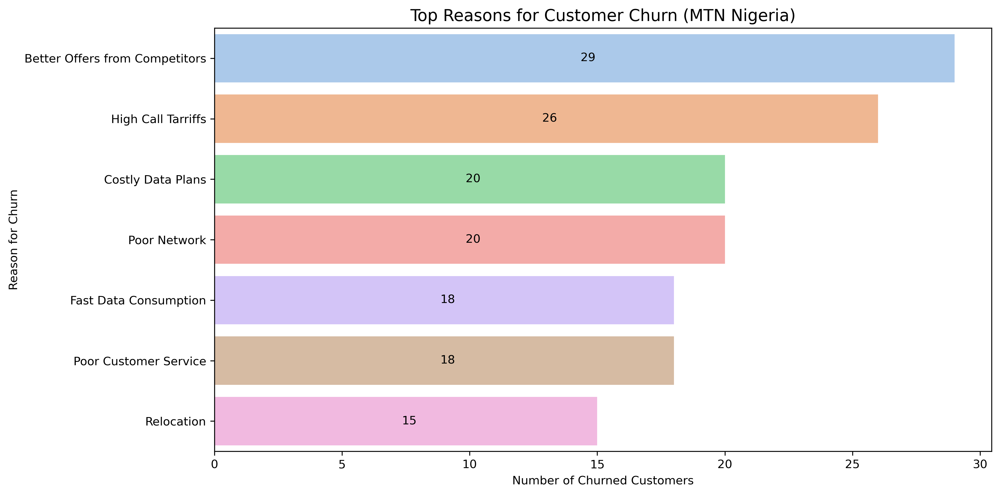

**Insights**:
- The leading cause for churn is "**Better Offers from Competitors**" followed closely by cost-related issues like "High Call Tariffs" and "Costly Data Plans." 
- Network quality and customer service also significantly contribute to customer churn. Addressing these pain points could help MTN improve customer retention.

### 3. Which States in Nigeria have the highest churn rates? (Top 10 states)
- First, let's check the number of unique states there are in the dataset:

```sql
SELECT COUNT( DISTINCT state) as num_of_states
FROM mtn_customer_churn;
```
|   num_of_states |
|----------------:|
|              35 |

- There are `35` **unique States** in the dataset. Now moving to the analysis:

```sql
SELECT
    state,
    COUNT(DISTINCT customer_id) AS total_customers,
    COUNT(DISTINCT CASE WHEN churn_status = 'Yes' THEN customer_id END) AS churned_customers,
    ROUND(
        COUNT(DISTINCT CASE WHEN churn_status = 'Yes' THEN customer_id END) * 100.0 
        / COUNT(DISTINCT customer_id),
        2
    ) AS churn_rate_percent
FROM mtn_customer_churn
GROUP BY state
ORDER BY churn_rate_percent DESC
LIMIT 10;
```
| state     |   total_customers |   churned_customers |   churn_rate_percent |
|:----------|------------------:|--------------------:|---------------------:|
| Adamawa   |                11 |                   7 |                63.64 |
| Imo       |                16 |                   9 |                56.25 |
| Kebbi     |                14 |                   7 |                50    |
| Benue     |                16 |                   7 |                43.75 |
| Niger     |                12 |                   5 |                41.67 |
| Yobe      |                17 |                   7 |                41.18 |
| Akwa Ibom |                10 |                   4 |                40    |
| Anambra   |                15 |                   6 |                40    |
| Edo       |                16 |                   6 |                37.5  |
| Kwara     |                11 |                   4 |                36.36 |

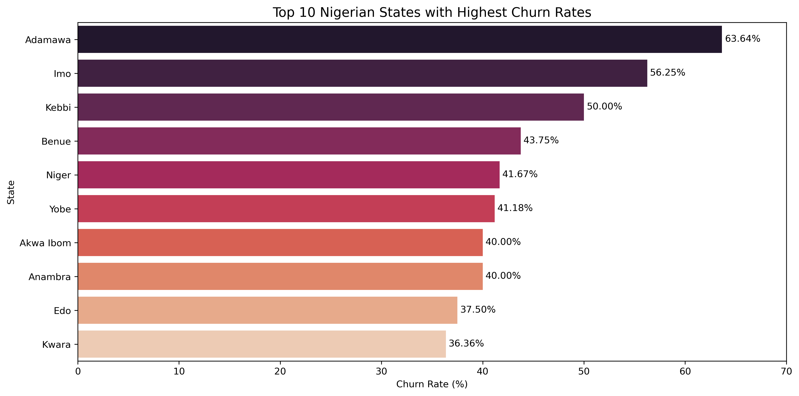

**Insights**:
- From the revised query, we observe that:
  - Adamawa has the highest churn rate at 63.64%, meaning nearly 2 out of 3 customers in that state have left.
  - Imo and Kebbi follow closely with 56.25% and 50% churn rates, respectively.
  - The average churn rate among these top 10 states ranges roughly between 36% to 64%, which is significantly higher than the national churn rate of 29.44% (from your earlier query). 

### 4. How do Age groups, Gender, or Tenure impact churn?
#### Age:

```sql
SELECT
  CASE
    WHEN age BETWEEN 16 AND 19 THEN 'Teen (16-19)'
    WHEN age BETWEEN 20 AND 29 THEN 'Young Adult (20-29)'
    WHEN age BETWEEN 30 AND 44 THEN 'Adult (30-44)'
    WHEN age BETWEEN 45 AND 59 THEN 'Mid-Age (45-59)'
    ELSE 'Senior (60-80)'
  END AS age_group,
  COUNT(DISTINCT customer_id) AS total_customers,
  COUNT(DISTINCT CASE WHEN churn_status = 'Yes' THEN customer_id END) AS churned_customers,
  ROUND(
    COUNT(DISTINCT CASE WHEN churn_status = 'Yes' THEN customer_id END) * 100.0 / COUNT(DISTINCT customer_id),
    2
  ) AS churn_rate_percent
FROM mtn_customer_churn
WHERE age IS NOT NULL
GROUP BY age_group
ORDER BY churn_rate_percent DESC;
```
| age_group           |   total_customers |   churned_customers |   churn_rate_percent |
|:--------------------|------------------:|--------------------:|---------------------:|
| Young Adult (20-29) |                79 |                  27 |                34.18 |
| Adult (30-44)       |               122 |                  38 |                31.15 |
| Teen (16-19)        |                20 |                   6 |                30    |
| Senior (60-80)      |               147 |                  41 |                27.89 |
| Mid-Age (45-59)     |               128 |                  34 |                26.56 |

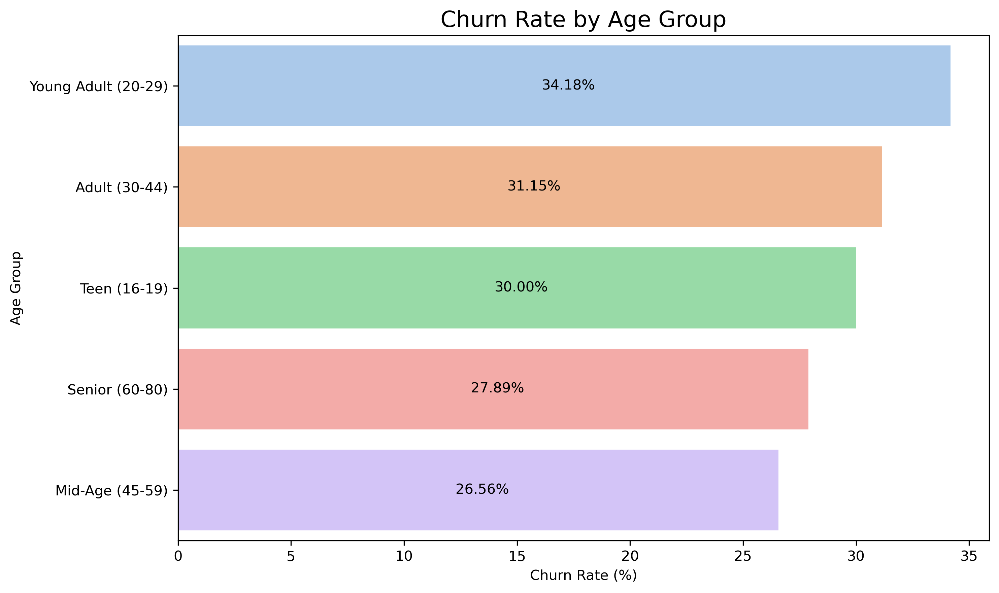

**Insights**:
- **Young Adults (ages 20–29)** had the highest churn rate at `34.18%`, followed by **Adults (30–44) and Teens**. 
- Meanwhile, **Mid-Age and Senior** groups showed relatively lower churn. This suggests that younger users may be more sensitive to pricing, offers, or competitor promotions and might require more tailored retention strategies

#### Gender:

```sql
SELECT
	gender,
    COUNT(DISTINCT customer_id) as total_customers,
    COUNT(DISTINCT CASE WHEN churn_flag = 'Yes' THEN customer_id END) as churned_customers,
    ROUND(COUNT(DISTINCT CASE WHEN churn_flag = 'Yes' THEN customer_id END) * 100.0 / COUNT(DISTINCT customer_id), 2) as churn_rate_percent
FROM	mtn_customer_churn
GROUP BY	gender
ORDER BY	churn_rate_percent;
```
| gender   |   total_customers |   churned_customers |   churn_rate_percent |
|:---------|------------------:|--------------------:|---------------------:|
| Female   |               250 |                 173 |                69.2  |
| Male     |               246 |                 177 |                71.95 |

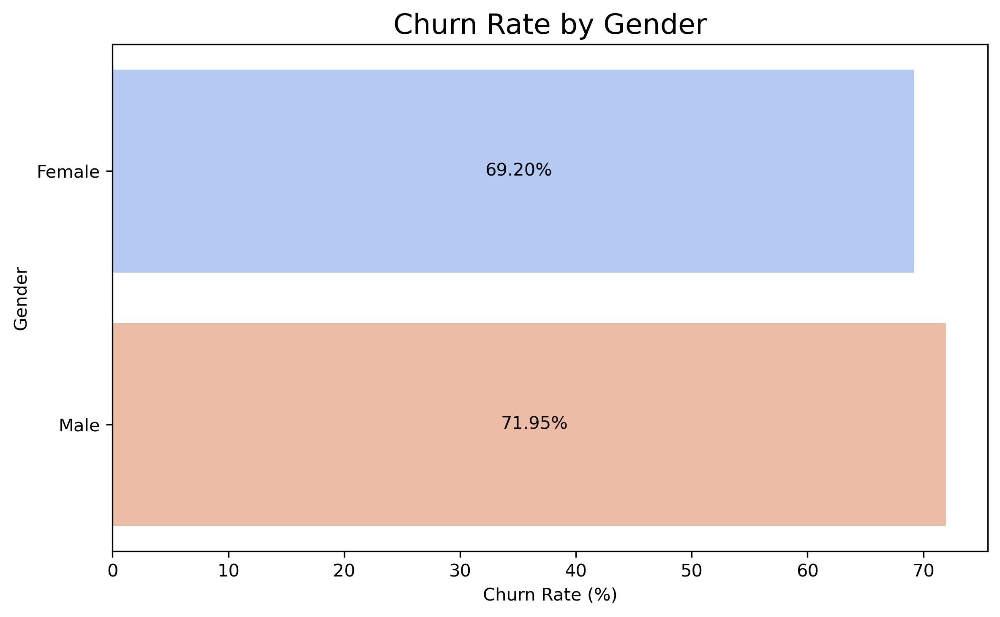

**Insights**:
- Both genders exhibit high churn rates, with:
  - Male customers showing a slightly higher churn rate (71.95%) than females (69.20%).

- The difference is modest (~2.75 percentage points), suggesting that gender is not a major driver of churn on its own, but may amplify other factors like device type, satisfaction, or plan suitability.

- This high churn rate across both genders may point to broader systemic issues, such as:
  - Pricing dissatisfaction
  - Customer service challenges
  - Plan or device performance gaps

#### Tenure:

```sql
SELECT
	CASE
		WHEN customer_tenure_mnths BETWEEN 0 AND 6 THEN 'New (0-6)'
        WHEN customer_tenure_mnths BETWEEN 7 AND 12 THEN 'Short-Term (7-12)'
        WHEN customer_tenure_mnths BETWEEN 13 AND 24 THEN 'Medium-Term (13-24)'
		WHEN customer_tenure_mnths BETWEEN 25 AND 48 THEN 'Long-Term (25-48)'
        ELSE 'Very Long-Term (49-60)'
	END AS tenure_group,
    COUNT(DISTINCT customer_id) as total_customers,
    COUNT(DISTINCT CASE WHEN churn_flag = 'Yes' THEN customer_id END) as churned_customers,
    ROUND(COUNT(DISTINCT CASE WHEN churn_flag = 'Yes' THEN customer_id END) * 100.0 / COUNT(DISTINCT customer_id), 2) as churn_rate_percent
FROM	mtn_customer_churn
GROUP BY 	tenure_group
ORDER BY	churn_rate_percent DESC;
```
| tenure_group           |   total_customers |   churned_customers |   churn_rate_percent |
|:-----------------------|------------------:|--------------------:|---------------------:|
| New (0-6)              |                42 |                  32 |                76.19 |
| Medium-Term (13-24)    |               100 |                  76 |                76    |
| Very Long-Term (49-60) |               111 |                  78 |                70.27 |
| Long-Term (25-48)      |               192 |                 130 |                67.71 |
| Short-Term (7-12)      |                51 |                  34 |                66.67 |

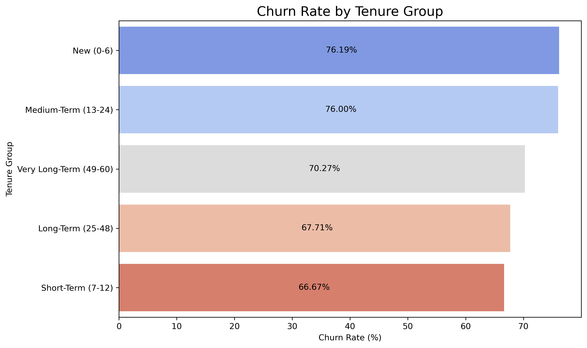

**Insights**:
- Highest Churn Risk: New and Medium-Term Customers
  - Customers in the New (0–6 months) and Medium-Term (13–24 months) brackets have the highest churn rates, both around 76%.
  - This indicates that early experience and mid-term engagement are critical pain points.
  - Potential reasons:
    - Onboarding issues or unmet expectations for new users.
    - Drop-off after promotional or trial periods for medium-term users.
- Slight Drop in Churn with Longer Tenure
  - Churn rate gradually decreases as tenure increases:
    - Very Long-Term (49–60 months): 70.27%
    - Long-Term (25–48 months): 67.71%
    - Short-Term (7–12 months): 66.67%
  - However, churn is still relatively high even among loyal, long-time users, suggesting:
    - Growing dissatisfaction over time.
    - Lack of reward or retention efforts for loyal customers.
- Retention Strategy Implication
  - Focus on onboarding and early engagement for new users to improve their first experience.
  - Offer loyalty rewards or personalized incentives to medium and long-term users to prevent mid-cycle drop-off.
  - Identify why long-term users still churn — possibly service fatigue or better offers from competitors.

### 5. What are the satisfaction trends among Churned vs. Active customers?

#### Satisfaction rate distribution by churn rate:

```sql
SELECT
    satisfaction_rate,
    COUNT(DISTINCT customer_id) AS customer_count,
    ROUND(COUNT(DISTINCT customer_id) * 100.0 / (SELECT COUNT(DISTINCT customer_id) FROM mtn_customer_churn), 2) AS percent_customers
FROM mtn_customer_churn
GROUP BY satisfaction_rate
ORDER BY satisfaction_rate;
```
|   satisfaction_rate |   customer_count |   percent_customers |
|--------------------:|-----------------:|--------------------:|
|                   1 |               98 |               19.76 |
|                   2 |               96 |               19.35 |
|                   3 |              107 |               21.57 |
|                   4 |              109 |               21.98 |
|                   5 |               86 |               17.34 |


#### Average Satisfaction by Churn Status:

```sql
WITH customer_avg_satisfaction AS (
    SELECT
        customer_id,
        churn_status,
        AVG(satisfaction_rate) AS avg_satisfaction_per_customer
    FROM mtn_customer_churn
    GROUP BY customer_id, churn_status
)

SELECT
    churn_status,
    COUNT(DISTINCT customer_id) AS total_customers,
    ROUND(AVG(avg_satisfaction_per_customer), 2) AS avg_satisfaction
FROM customer_avg_satisfaction
GROUP BY churn_status;
```
| churn_status   |   total_customers |   avg_satisfaction |
|:---------------|------------------:|-------------------:|
| No             |               350 |               2.93 |
| Yes            |               146 |               3.08 |

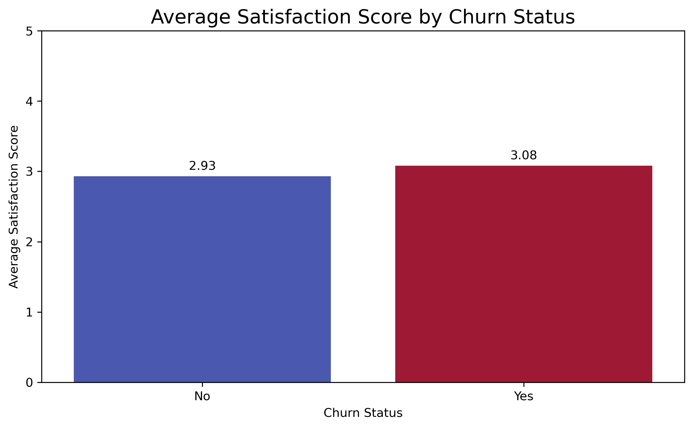

**Insights**:
- Churned customers reported slightly higher satisfaction (`3.08`) than retained customers (`2.93`), a counterintuitive result.
- This suggests satisfaction score alone may not be a strong predictor of churn in this dataset.
- Customers may be leaving despite being moderately satisfied, possibly due to other reasons like:
  - Network issues
  - Pricing or better offers elsewhere
  - Contract expiration or device lifecycle
  - Payment experience or data limits
- The difference is minimal (`0.15` points), indicating that overall satisfaction levels are generally low across the board — whether they churned or not.

#### Analyze Customer Reviews vs Churn to see if subjective sentiment matches the churn behavior:

```sql
SELECT
    churn_status,
    customer_review,
    COUNT(DISTINCT customer_id) AS count
FROM mtn_customer_churn
GROUP BY 	1, 2
ORDER BY 	1, 2;
```
| churn_status   | customer_review   |   count |
|:---------------|:------------------|--------:|
| No             | Poor              |      72 |
| Yes            | Poor              |      26 |
| No             | Fair              |      66 |
| Yes            | Fair              |      30 |
| No             | Good              |      80 |
| Yes            | Good              |      27 |
| No             | Very Good         |      77 |
| Yes            | Very Good         |      32 |
| No             | Excellent         |      55 |
| Yes            | Excellent         |      31 |


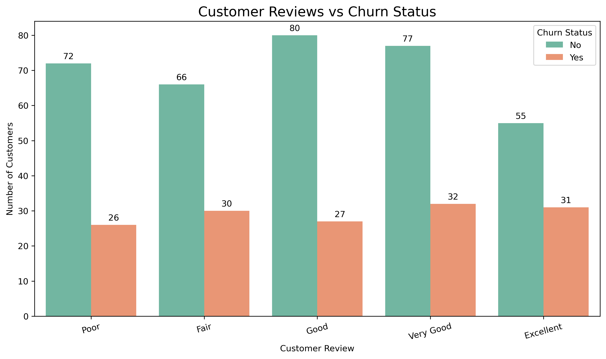

**Insights**:
- Churn occurs across all review levels, even among customers who gave “Excellent” or “Very Good” feedback.
  - 36% of “Excellent” reviewers still churned, the highest churn rate among all review levels.
  - This suggests positive reviews do not guarantee loyalty.
- The lowest churn rate (25.2%) came from “Good” reviewers, not “Excellent” or “Very Good.”
  - It’s possible “Good” reflects a stable, satisfied customer, while “Excellent” may have been given in the past but does not reflect recent experiences or decisions.
- Even among “Poor” reviewers, nearly 3 out of 4 (73.5%) did not churn.
  - This suggests that negative sentiment doesn't always lead to immediate churn, possibly due to lack of alternatives or contract lock-ins.

### 6. Which Devices or Data Plans have the highest Churn?

#### Churn Rate by MTN Device

```sql
SELECT
    mtn_device,
    COUNT(DISTINCT customer_id) AS total_customers,
    COUNT(DISTINCT CASE WHEN churn_status = 'Yes' THEN customer_id END) AS churned_customers,
    ROUND(
        COUNT(DISTINCT CASE WHEN churn_status = 'Yes' THEN customer_id END) * 100.0 / COUNT(DISTINCT customer_id),
        2
    ) AS churn_rate_percent
FROM mtn_customer_churn
GROUP BY mtn_device
ORDER BY churn_rate_percent DESC;
```
| mtn_device          |   total_customers |   churned_customers |   churn_rate_percent |
|:--------------------|------------------:|--------------------:|---------------------:|
| Mobile SIM Card     |               290 |                  93 |                32.07 |
| 4G Router           |               216 |                  65 |                30.09 |
| 5G Broadband Router |               229 |                  64 |                27.95 |
| Broadband MiFi      |               228 |                  61 |                26.75 |

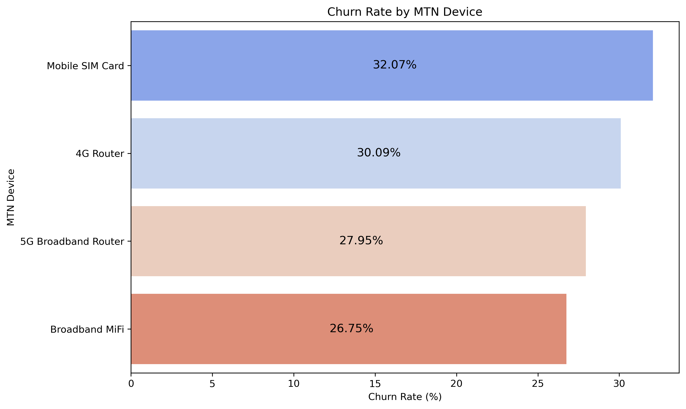

**Insights**:
- **Mobile SIM Card** users have the highest churn rate (`32.07%`), indicating they are the most likely to leave.
  - This could suggest higher dissatisfaction among mobile-only users, or that they are easier to switch due to lower device commitment.
- **Routers (4G and 5G)** show slightly lower churn, with 4G Router at `30.09%` and 5G at `27.95%`.
  - These users might be more stable, possibly due to home/office setups or higher device investment.
- **Broadband MiFi** users have the lowest churn (`26.75%`), indicating they might be more satisfied or reliant on MTN for portable broadband needs.

#### Churn Rate by Subscription Plan

```sql
SELECT
    subscription,
    COUNT(DISTINCT customer_id) AS total_customers,
    COUNT(DISTINCT CASE WHEN churn_status = 'Yes' THEN customer_id END) AS churned_customers,
    ROUND(
        COUNT(DISTINCT CASE WHEN churn_status = 'Yes' THEN customer_id END) * 100.0 / COUNT(DISTINCT customer_id),
        2
    ) AS churn_rate_percent
FROM mtn_customer_churn
GROUP BY 	1
ORDER BY	churn_rate_percent DESC;
```
| subscription                 |   total_customers |   churned_customers |   churn_rate_percent |
|:-----------------------------|------------------:|--------------------:|---------------------:|
| 200GB Monthly Broadband Plan |                31 |                  14 |                45.16 |
| 3.2GB 2-Day Plan             |                35 |                  15 |                42.86 |
| 65GB Monthly Plan            |                63 |                  23 |                36.51 |
| 20GB Monthly Plan            |                23 |                   8 |                34.78 |
| 16.5GB+10mins Monthly Plan   |                30 |                  10 |                33.33 |
| 2.5GB 2-Day Plan             |                30 |                  10 |                33.33 |
| 25GB Monthly Plan            |                49 |                  16 |                32.65 |
| 1.5GB 2-Day Plan             |                29 |                   9 |                31.03 |
| 300GB FUP Monthly Unlimited  |                72 |                  22 |                30.56 |
| 7GB Monthly Plan             |                27 |                   8 |                29.63 |
| 1GB+1.5mins Daily Plan       |                24 |                   7 |                29.17 |
| 165GB Monthly Plan           |                73 |                  21 |                28.77 |
| 1.5TB Yearly Broadband Plan  |                25 |                   7 |                28    |
| 500MB Daily Plan             |                29 |                   8 |                27.59 |
| 30GB Monthly Broadband Plan  |                73 |                  20 |                27.4  |
| 12.5GB Monthly Plan          |                38 |                  10 |                26.32 |
| 150GB FUP Monthly Unlimited  |                75 |                  19 |                25.33 |
| 60GB Monthly Broadband Plan  |                79 |                  19 |                24.05 |
| 450GB 3-Month Broadband Plan |                25 |                   6 |                24    |
| 10GB+10mins Monthly Plan     |                67 |                  14 |                20.9  |
| 120GB Monthly Broadband Plan |                66 |                  13 |                19.7  |

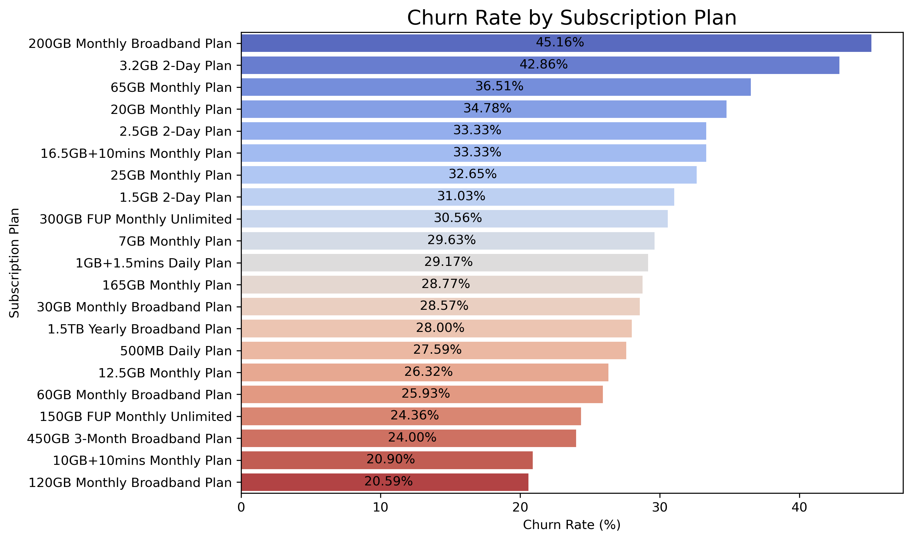

**Insights**:
- The **200GB Monthly Plan and 3.2GB 2-Day Plan**) have the highest churn rates, over `40%`.
- Smaller or mid-sized monthly plans like **65GB, 25GB and 20GB** also show above-average churn.
- Large, long-term Broadband Plans like **1.5TB Yearly Plan, 120GB Monthly and 150GB FUP Unlimited** have the lowest churn rates (under `25%`).
- Higher churn in smaller or short-duration plans suggest that users on these may be:
  - Trying out the service
  - Price-sensitive
  - Unhappy with value-for-money
- Longer-term and higher-volume plans likely retain customers better due to:
  - Higher commitment and investment
  - Possibly better experiences or perceived value

### 7. How much Revenue is lost to Churn?

#### Double check for inconsistent prices in the table

```sql
SELECT
	subscription,
    COUNT(DISTINCT unit_price) as price_variants
FROM	mtn_customer_churn
GROUP BY	1
HAVING	COUNT(DISTINCT unit_price) > 1;
```
| subscription   | price_variants   |
|----------------|------------------|

*No inconsistencies found in this query result.*

#### Get the Total Revenue lost due to Churn

```sql
WITH customer_revenue AS (
    SELECT
        customer_id,
        churn_status,
        SUM(total_revenue) as customer_total_revenue
    FROM mtn_customer_churn
    GROUP BY customer_id, churn_status
),

revenue_stats AS (
    SELECT
        SUM(CASE WHEN churn_status = 'Yes' THEN customer_total_revenue ELSE 0 END) as revenue_lost_to_churn,
        SUM(customer_total_revenue) as total_revenue
    FROM customer_revenue
)

SELECT
    revenue_lost_to_churn,
    total_revenue,
    ROUND((revenue_lost_to_churn / total_revenue) * 100, 2) as churn_revenue_percent
FROM revenue_stats;
```
|   revenue_lost_to_churn |   total_revenue |   churn_revenue_percent |
|------------------------:|----------------:|------------------------:|
|                58000200 |       199348200 |                   29.09 |

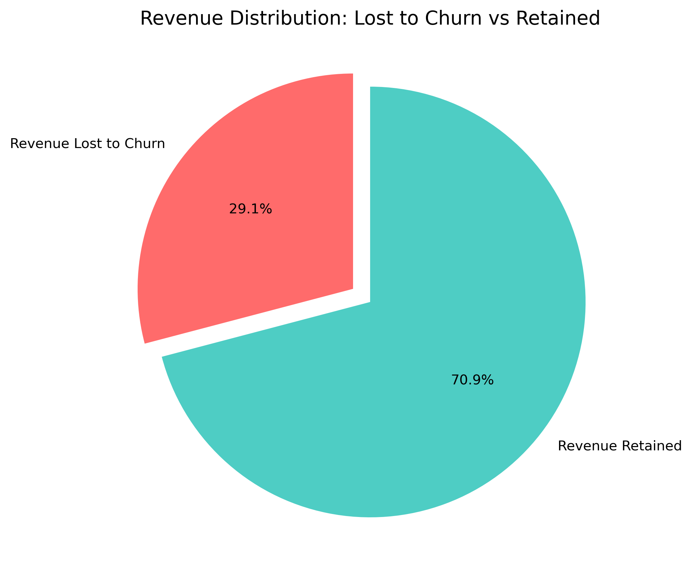

**Insights**:
- Key Metrics:
  - **Total Revenue (All Customers)**: `199,348,200`
  - **Revenue lost to Churned Customers**: `58,000,200`
  - **% of Revenue Lost to Churn**: `29.09%`
- Nearly **₦1** out of every **₦3** earned is lost due to customers leaving MTN, a major revenue risk.

#### Check the prices of each Subscription Plan:

```sql
SELECT	DISTINCT subscription, unit_price
FROM	mtn_customer_churn
ORDER BY	2 DESC;
```
| subscription                 |   unit_price |
|:-----------------------------|-------------:|
| 1.5TB Yearly Broadband Plan  |       150000 |
| 450GB 3-Month Broadband Plan |        75000 |
| 165GB Monthly Plan           |        35000 |
| 300GB FUP Monthly Unlimited  |        30000 |
| 200GB Monthly Broadband Plan |        25000 |
| 120GB Monthly Broadband Plan |        24000 |
| 150GB FUP Monthly Unlimited  |        20000 |
| 65GB Monthly Plan            |        16000 |
| 60GB Monthly Broadband Plan  |        14500 |
| 25GB Monthly Plan            |         9000 |
| 30GB Monthly Broadband Plan  |         9000 |
| 20GB Monthly Plan            |         7500 |
| 16.5GB+10mins Monthly Plan   |         6500 |
| 12.5GB Monthly Plan          |         5500 |
| 10GB+10mins Monthly Plan     |         4500 |
| 7GB Monthly Plan             |         3500 |
| 3.2GB 2-Day Plan             |         1000 |
| 2.5GB 2-Day Plan             |          900 |
| 1.5GB 2-Day Plan             |          600 |
| 1GB+1.5mins Daily Plan       |          500 |
| 500MB Daily Plan             |          350 |

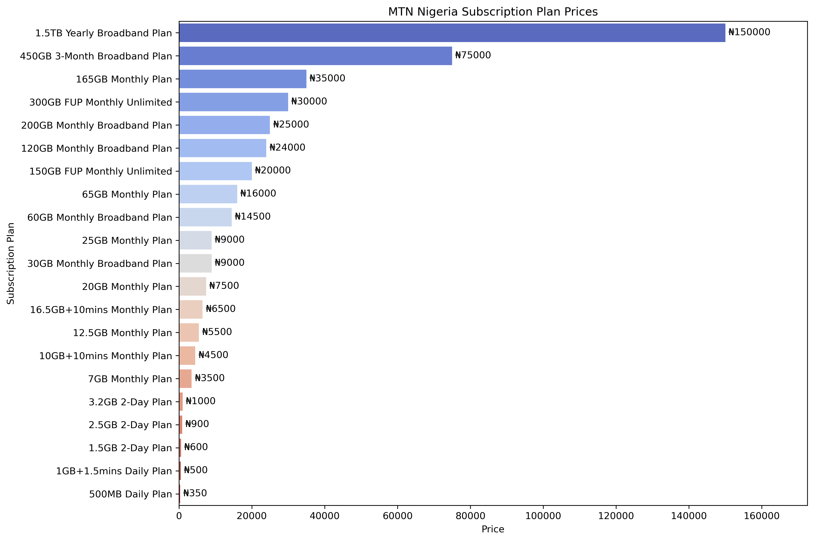

#### Revenue Lost to Churn by Subscription Plan

```sql
SELECT
	subscription,
    COUNT(*) as churned_customers,
    SUM(total_revenue) as revenue_lost
FROM	mtn_customer_churn
WHERE	churn_status = 'Yes'
GROUP BY	1
ORDER BY	revenue_lost DESC;
```
| subscription                 |   churned_customers |    revenue_lost |
|:-----------------------------|--------------------:|----------------:|
| 1.5TB Yearly Broadband Plan  |                   7 | 15300000        |
| 165GB Monthly Plan           |                  21 | 7595000         |
| 300GB FUP Monthly Unlimited  |                  22 | 6900000         |
| 450GB 3-Month Broadband Plan |                   6 | 4425000         |
| 200GB Monthly Broadband Plan |                  14 | 4100000         |
| 150GB FUP Monthly Unlimited  |                  19 | 3580000         |
| 120GB Monthly Broadband Plan |                  14 | 3456000         |
| 65GB Monthly Plan            |                  23 | 3200000         |
| 60GB Monthly Broadband Plan  |                  21 | 2972500         |
| 30GB Monthly Broadband Plan  |                  22 | 1881000         |
| 25GB Monthly Plan            |                  16 | 1449000         |
| 16.5GB+10mins Monthly Plan   |                  10 | 754000          |
| 10GB+10mins Monthly Plan     |                  14 | 639000          |
| 20GB Monthly Plan            |                   8 | 555000          |
| 12.5GB Monthly Plan          |                  10 | 533500          |
| 7GB Monthly Plan             |                   8 | 259000          |
| 3.2GB 2-Day Plan             |                  15 | 157000          |
| 2.5GB 2-Day Plan             |                  10 | 110700          |
| 1.5GB 2-Day Plan             |                   9 |  64200          |
| 1GB+1.5mins Daily Plan       |                   7 |  42000          |
| 500MB Daily Plan             |                   8 |  27300          |

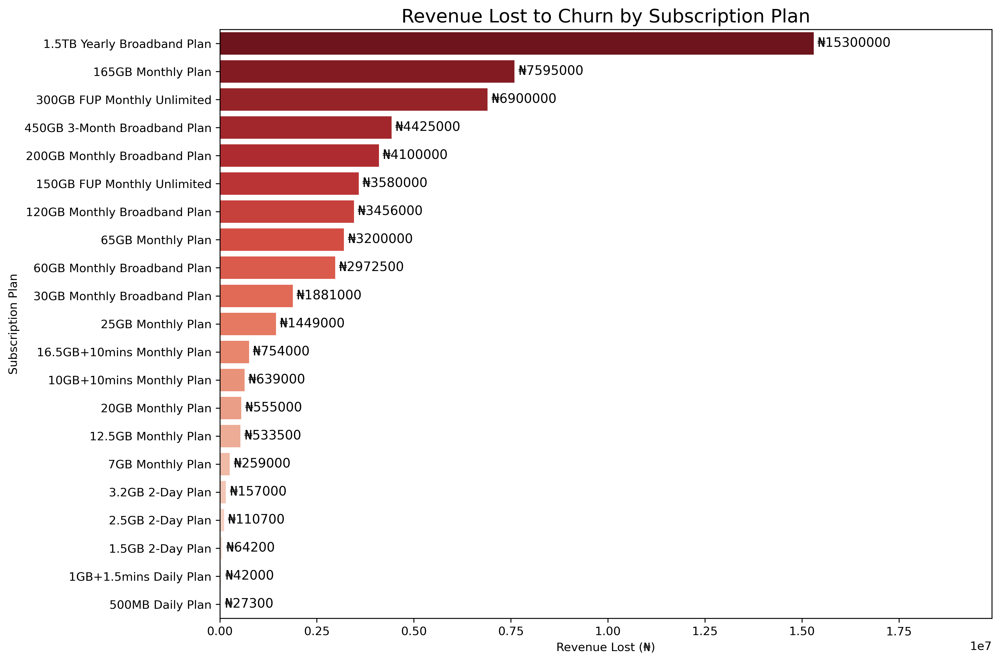

**Insights**:
- The **1.5TB Yearly Broadband Plan**, despite only 7 churned customers, caused the highest revenue loss of ``₦15.3`` million, a direct result of its premium pricing (`₦150,000` per user)
- Other high-value plans with significant losses:
  - **165GB Monthly Plan**: `₦7.6M` lost from 21 churned users
  - **300GB FUP Monthly Unlimited**: `₦6.9M` from 22 churned users
  - **450GB 3-Month Plan**: `₦4.4M` from 6 users
  - **200GB Monthly Broadband Plan**: `₦4.1M` from 14 users
- These premium plans have fewer users but high price points, meaning each churned customer has a larger financial impact.

## Business Recommendations to Reduce Customer Churn:

### 1. Target Pricing-Sensitive Segments
- **Findings**: High churn was observed among users of smaller data plans (e.g., **200GB Monthly, 3.2GB 2-Day Plan**).
- **Action**:
  - Re-evaluate pricing for low-to-mid-tier plans.
  - Offer better value bundles or loyalty discounts.
  - Introduce personalized data plans based on usage patterns.

### 2. Prioritize Retention of High-Value Customers
- **Findings**: Premium Broadband users (e.g., **1.5TB Yearly**) cause significant revenue loss despite low churn numbers.
- **Actions**:
  - Implement a dedicated VIP customer retention program.
  - Offer exclusive support or perks to premium plan subscribers.
  - Set up alerts for high-value users nearing churn thresholds.

### 3. Address State-Specific Churn Hotspots
- **Findings**: States like **Adamawa** have churn rates exceeding 60%.
- **Actions**:
  - Conduct deeper surveys in high-churn states to identify localized issues.
  - Improve network reliability or expand customer service access in these regions.
  - Launch targeted promotions in regions with high churn

### 4. Rethink Customer Satisfaction Metrics
- **Findings**: Customers who churned often gave positive satisfaction scores or reviews.
- **Actions**:
  - Supplement surveys with **behavioral analytics** (e.g., usage drops, missed payments).
  - Identify churn risk factors beyond self-reported satisfaction, such as **tenure drop-offs** or price frustration.

### 5. Improve First-Year Customer Onboarding
- **Findings**: New Customers (0-6 months) had the lowest churn rate, but churn rises significantly after.
- **Actions**:
  - Create onboarding journeys that extend into the first year, not just the first month.
  - Provide proactive engagement at key milestones (3 months, 6 months).

### 6. Engage the 30-44 and 20-29 Age Segments More Actively
- **Findings**: These two age groups represent the highest churn, possibly due to digital literacy and comparison behavior.
- **Action**:
  - Tailor campaigns using social media, influencer marketing, or referral bonuses.
  - Offer app-based loyalty rewards or gamified retention strategies.

### 7. Focus on Device and Plan Experience
- **Findings**: Churn is highest among Mobile SIM and short-term pan users.
- **Actions**:
  - Enhance user experience and perceived value of SIM-based plans.
  - Encourage upgrades by showing long-term plan benefits via SMS/app notifications.

### 8. Quantify Churn Impact for Stakeholders
- **Findings**: MTN lost **₦58 million** (`~29%`) of revenue to churn in just one quarter.
- **Actions**:
  - Present churn cost analysis regularly to leadership.
  - Use revenue risk to justify investment in retention initiatives.
