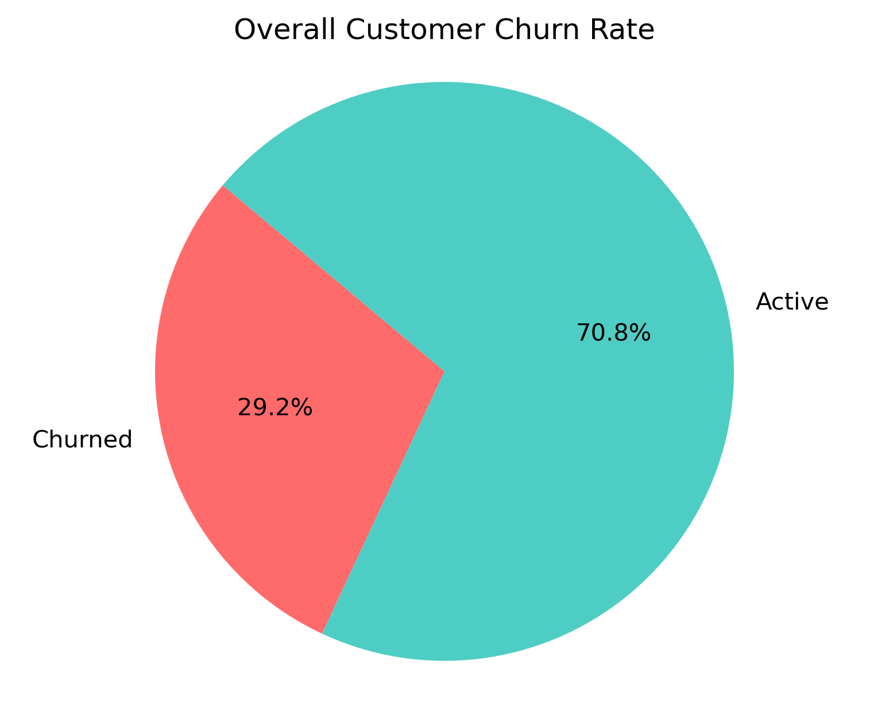

# MTN Nigeria Customer Churn Exploratory Data Analysis

## What is MTN Nigeria?
- MTN Nigeria Communications PLC is the leading telecommunications provider in Nigeria and a subsidiary of the **MTN Group**, a multinational telecom company headquartered in South Africa. Established in 2000, MTN Nigeria has grown to become the country's largest mobile network operator per [Emis](https://www.emis.com/php/company-profile/NG/Mtn_Nigeria_Communications_Plc_en_8352912.html).

## What is Customer Churn?
- Customer churn is a business phenomenon where customers stop doing business with a company or stop using a product/service over a given period of time. Also known as **customer attrition**.

### Why does it matter in Business?
- Churn is a key performance indicator for many businesses, especially in industries like:

  - Subscription services
  - Telecommunications
  - SaaS
  - Banking & Insurance
  - E-Commerce

### What are common causes of Churn?
- Causes vary as these range from `Poor customer service`, `High prices`, `Better offers from competitors`, `Lack of product engagement or perceived value` and `Bad user experience`.

## Relevance of the Analysis
- Given MTN Nigeria's extensive subscriber base and diverse service offerings, analyzing customer churn can provide insights into:

  - **Customer Retention**: Understanding why customers discontinue services can help in developing strategies to improve retention.
  - **Service Improvement**: Identifying patterns in churn can highlight areas where service enhancements are needed.
  - **Market Strategy**: Analyzingg churn across different demographics and regions can inform targeted marketing and service delivery.

## The Dataset
- The dataset was taken from [Kaggle](https://www.kaggle.com/datasets/oluwademiladeadeniyi/mtn-nigeria-customer-churn?resource=download). The dataset simulates the behaviour, preferences and churn patterns of MTN Nigeria customers in Q1 2025. It provides rich insight into device usage, data plan preferences, age, groups, tenure, churn drivers, and revenue patterns. The dataset contains 974 rows and possess the following columns:

  - Customer ID: A unique identifier assigned to each customer. It may appear more than once if the customer owns multiple devices.
  - Full Name: The full name of the customer. Names reflect a balance across Nigerian ethnicities and regions.
  - Date of Purchase: Month and year the device or plan was purchased. All entries are from 2025.
  - Age: Age of the customer (between 16 and 80). Rules apply to age and purchasing behaviour.
  - State: Nigerian state where the customer resides, including the FCT.
  - MTN Device: Device purchased by the customer. Includes: Mobile SIM Card, Broadband MiFi, 4G Router, 5G Broadband Router.
  - Gender: Gender of the customer (Male or Female).
  - Satisfaction Rate: A score from 0 to 5 reflecting the customer’s satisfaction.
  - Customer Review: Categorical review of the customer experience: Poor, Fair, Good, Very Good, Excellent.
  - Customer Tenure in months: How long the customer has been subscribed (in months).
  - Subscription Plan: The name of the MTN data plan purchased (e.g., 60GB Monthly Broadband Plan, 7GB Monthly Plan, etc.).
  - Unit Price: Cost of the data plan in Nigerian Naira (₦).
  - Data Usage: Estimated data usage in gigabytes (GB). Not necessarily equal to the plan size—it reflects usage behaviour.
  - Number of Times Purchased: How many times the plan was purchased within the month (simulates customer consumption rate).
  - Total Revenue: Total amount spent by the customer (calculated as Unit Price × Number of Times Purchased).
  - Customer Churn Status: Indicates whether the customer has churned (Yes) or is still active (No).
  - Reasons for Churn: If churned, this field shows the reason (e.g., Poor Network, Relocation, High Call Tariffs, etc.). Empty for active customers.

## Data Cleaning
1. The dataset consisted of columns with their names not snake_cased. For it to be easier to code, we converted the column names to a much more efficient and easier to write on query snake_cased format:

```sql
ALTER TABLE mtn_customer_churn
CHANGE COLUMN `Date of Purchase` date_of_purchase VARCHAR(20),
CHANGE COLUMN `Customer ID` customer_id VARCHAR(20),
CHANGE COLUMN `Age` age INT,
CHANGE COLUMN `State` state VARCHAR(20),
CHANGE COLUMN `MTN Device` mtn_device VARCHAR(20),
CHANGE COLUMN `Gender` gender VARCHAR(20),
CHANGE COLUMN `Satisfaction Rate` satisfaction_rate INT,
CHANGE COLUMN `Customer Review` customer_review VARCHAR(20),
CHANGE COLUMN `Customer Tenure in months` customer_tenure_mnths INT,
CHANGE COLUMN `Subscription Plan` subscription VARCHAR(500),
CHANGE COLUMN `Unit Price` unit_price INT,
CHANGE COLUMN `Number of Times Purchased` num_purchase INT,
CHANGE COLUMN `Total Revenue` total_revenue INT,
CHANGE COLUMN `Data Usage` data_usage DECIMAL(5, 2),
CHANGE COLUMN `Customer Churn Status` churn_status VARCHAR(20),
CHANGE COLUMN `Reasons for Churn` reason VARCHAR(500);

ALTER TABLE mtn_customer_churn
CHANGE COLUMN `Full Name` full_name VARCHAR(50);
```

2. Converted the `Date of Purchase` column from having the first 3 strings cite the first 3 letters of the Months in Q1 into numerical month format:

```sql
UPDATE mtn_customer_churn
SET date_of_purchase = CONCAT(
    CASE LEFT(date_of_purchase, 3)
      WHEN 'Jan' THEN '01'
      WHEN 'Feb' THEN '02'
      WHEN 'Mar' THEN '03'
      ELSE '00'
	END,
    '-20',
    RIGHT(date_of_purchase, 2)
);
```

3. It was given in the Dataset description that there will be duplicate entries of `CustomerID` as this pose as customers having multiple devices listed in the Dataset, still, the possibility of **EXACT DUPLICATES** is still there; So we did that with:

```sql
SELECT
customer_id, full_name, COUNT(*) as duplicate_count
FROM mtn_customer_churn
GROUP BY customer_id, full_name, date_of_purchase, age, state, mtn_device, gender, satisfaction_rate,
customer_review, customer_tenure_mnths, subscription, unit_price, num_purchase, total_revenue, data_usage,
churn_status, reason
HAVING duplicate_count > 1;
```
Result:
| customer_id | full_name | duplicate_count |
|-------------|-----------|-----------------|

*No duplicates found in this query result.*

4. Since there weren't any exact duplicates in the dataset, let's check the amount of devices a customer can posses in the dataset:

```sql
SELECT
customer_id, full_name, COUNT(DISTINCT mtn_device) as device_count
FROM mtn_customer_churn
GROUP BY 1, 2
ORDER BY device_count DESC
LIMIT 10; #the top 10 customers have a maximum device count of 3
```
Result:
| customer_id   | full_name       |   device_count |
|:--------------|:----------------|---------------:|
| CUST0015      | Abubakar Garner |              3 |
| CUST0500      | Oghene Hamilton |              3 |
| CUST0003      | Saidu Evans     |              3 |
| CUST0016      | Kunle Ford      |              3 |
| CUST0020      | Amaka Reed      |              3 |
| CUST0006      | Tamuno Lewis    |              3 |
| CUST0025      | Ifeanyi Brown   |              3 |
| CUST0030      | Alabo Davis     |              3 |
| CUST0027      | Maryam Reyes    |              3 |
| CUST0010      | Halima Ochoa    |              3 |

**The maximum amount of devices a customer possess are 3 devices.**

5. Let's see if there are null values in the reason column:

```sql
SELECT
	COUNT(*) as total_rows, 
	COUNT(reason) as reason_filled,
	SUM(CASE WHEN reason IS NULL OR reason = '' THEN 1 ELSE 0 END) as reason_missing
FROM mtn_customer_churn; #690 customers have reason for churn as empty
```

Result:
|   total_rows |   reason_filled |   reason_missing |
|-------------:|----------------:|-----------------:|
|          974 |             974 |              690 |

**690 customers have reason for churn as empty, but these only apply to customers who HAVEN'T churned from MTN**

6. Let's double-check if **ALL** missing reasons are only for customers who retained:

```sql
SELECT 	DISTINCT churn_status,
		COUNT(*) as count_missing_reason
FROM mtn_customer_churn
WHERE reason IS NULL OR reason = ''
GROUP BY 1; #all of the 690 missing churn reason are from customers who have not churned
```

Result:
| churn_status   |   count_missing_reason |
|:---------------|-----------------------:|
| No             |                    690 |

**It seems all 690 missing reasons are from customers who haven't churned.**

7. Create a `churn_flag`  column which converts the `churn_status` "Yes" and "No" into numeric 1 or 0 for deeper analysis:

```sql
ALTER TABLE mtn_customer_churn
ADD COLUMN churn_flag TINYINT;

UPDATE mtn_customer_churn
SET churn_flag = CASE
	WHEN churn_status = 'Yes' THEN 1
	ELSE 0
END;

ALTER TABLE mtn_customer_churn
MODIFY COLUMN churn_flag TINYINT AFTER churn_status; #move the churn_flag column next to the churn_status column
```

# Exploratory Data Analysis
## 1. What Percentage of MTN Nigeria have churned out of the total customer base?

```sql
SELECT
	COUNT(*) as total_customers,
    SUM(CASE WHEN churn_status = 'Yes' THEN 1 ELSE 0 END) as churned_customers,
    ROUND(SUM(CASE WHEN churn_status = 'Yes' THEN 1 ELSE 0 END) / COUNT(*) * 100, 2) as churn_rate_percent
FROM mtn_customer_churn;
```
|   total_customers |   churned_customers |   churn_rate_percent |
|------------------:|--------------------:|---------------------:|
|               974 |                 284 |                29.16 |



- About `29.16%` of MTN Nigeria's Customers in the Q1 of 2025 have churned. That's almost 3 out of every 10 customers, a **significant** number worth digging into
